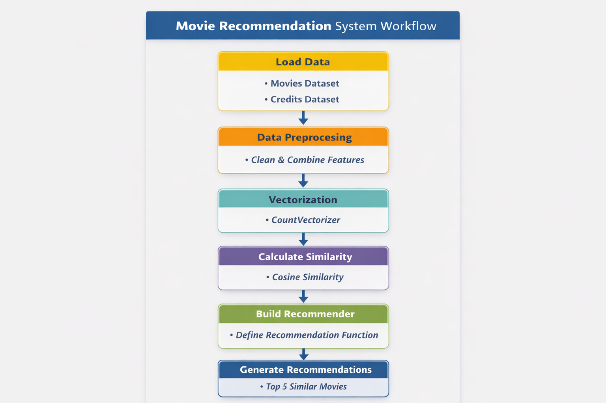
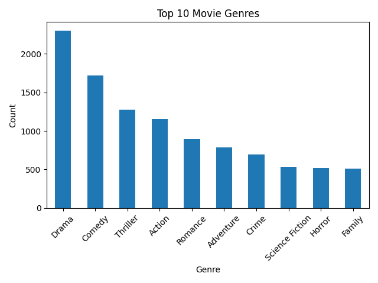
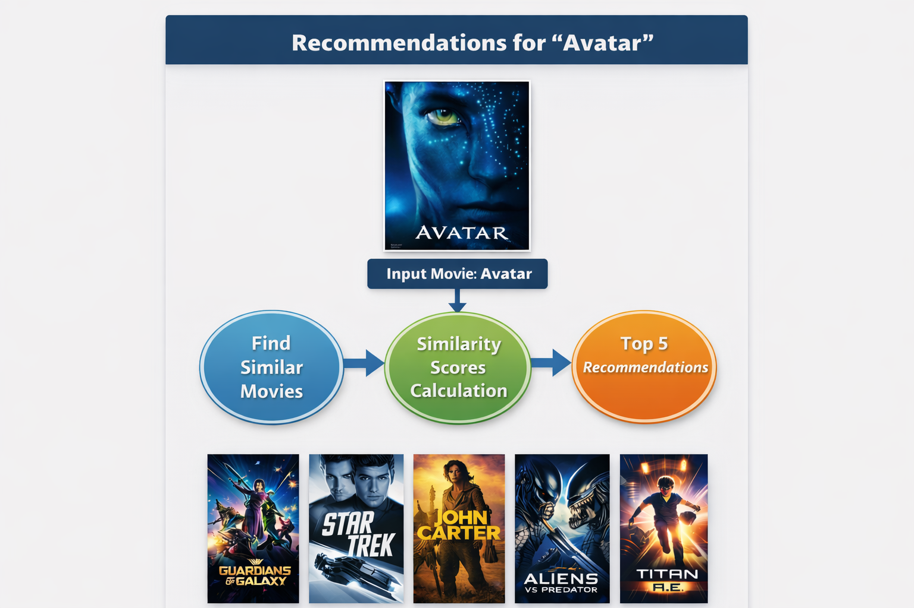

# Movie Recommendation System

This project builds a **Content-Based Movie Recommendation System** that recommends movies similar to a selected movie based on genres, keywords, cast, director, and overview.  

Using Natural Language Processing (NLP) and Cosine Similarity, the system demonstrates how similarity-based recommendation engines work in real-world applications.

---

## Project Workflow

The following workflow outlines the key steps in the project:

- Load movie and credits datasets  
- Merge datasets  
- Perform data cleaning and preprocessing  
- Feature engineering (combine text features into a single column)  
- Text vectorization using CountVectorizer  
- Compute Cosine Similarity  
- Build recommendation function  

<p align="center">
  
</p>

---

## Files in the Repository

- `Movie Recommendation System.ipynb` → Complete preprocessing, vectorization, and recommendation implementation  
- `tmdb_5000_movies.csv` → Movie metadata dataset  
- `tmdb_5000_credits.csv` → Cast and crew dataset  
- `ratings_small.csv` → User ratings dataset (for future collaborative filtering)  
- `README.md` → Project documentation  
- `images/` → Diagrams and charts used in documentation  

---

## Tech Stack

- **Language**: Python  
- **Libraries Used**:
  - `numpy`, `pandas` → Data manipulation  
  - `matplotlib`, `seaborn` → Visualization  
  - `scikit-learn` → Vectorization & similarity computation  
  - `nltk` (optional) → Text preprocessing  

---

## Exploratory Data Analysis

The project combines **movies** and **credits** datasets.

<p align="center">
  
</p>

EDA included:

- Checking for missing values and removing null entries  
- Converting JSON-like strings into Python objects  
- Extracting top 3 cast members and director  
- Cleaning and lowercasing text data  
- Combining genres, keywords, cast, director, and overview into a single **"tags"** column  

---

## Model Building & Similarity Computation

Unlike regression problems, this project does not train a predictive model.  
Instead, it uses vector similarity techniques.

### Text Vectorization

- **CountVectorizer (max_features=5000, stop_words='english')**

### Similarity Measure

- **Cosine Similarity**

Cosine similarity measures the angle between two vectors:

- `1` → Very similar  
- `0` → Not similar  
- `-1` → Opposite  

This generates a similarity matrix between all movies in the dataset.

---

## Recommendation System

A recommendation function was created:

```python
def recommend(movie_name):
```

### How it works

- Finds the selected movie index  
- Retrieves similarity scores  
- Sorts movies by similarity  
- Returns the top 5 most similar movies  

### Example

```python
recommend("Avatar")
```

**Example Output:**

- Guardians of the Galaxy  
- Star Trek  
- John Carter  
- Aliens vs Predator  
- Titan A.E.  

---

## Results

<p align="center">
  
</p>

Since this is a recommendation system, traditional regression metrics like MAE or R² are not applicable.  
Performance is evaluated based on semantic similarity and recommendation relevance.

---

## Interpretation & Key Findings

### How similarity works

- Movies sharing genres, cast, director, or similar descriptions receive higher similarity scores  
- The system effectively captures thematic relationships between films  

### Strengths

- Works without user rating history  
- Fast similarity computation once matrix is built  
- Easy to scale to larger datasets  

### Limitations

- No personalization (same recommendation for all users)  
- Does not use user behavior data  
- Suffers from cold-start problem for new entries  

### Practical takeaway

- Content-based filtering is a strong baseline recommendation approach  
- For better personalization, hybrid systems combining collaborative filtering should be implemented  

---

## Future Improvements

- Implement **Collaborative Filtering** using `ratings_small.csv`  
- Build a **Hybrid Recommendation System**  
- Replace CountVectorizer with **TF-IDF**  
- Use deep learning embeddings (Word2Vec / BERT)  
- Deploy using **Streamlit** or **Flask**  
- Integrate TMDB API to display movie posters and details  
